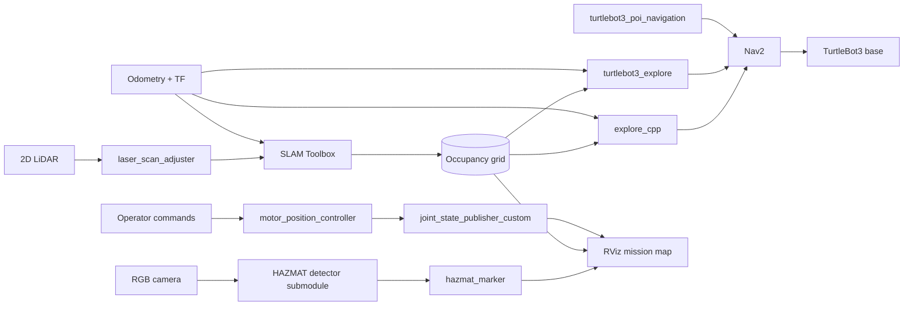

<h1 align="center">TurtleBot3 Autonomy Stack</h1>

<p align="center">
  <strong>Multi-package ROS 2 workspace for autonomous exploration, navigation, spatial perception and custom mechanism control.</strong>
</p>

<p align="center">
  
  
  
  
  
</p>

## Overview

This repository captures a complete early autonomy workspace built around TurtleBot3 and ROS 2. Rather than containing a single demo node, it integrates multiple implementations and supporting packages for:

- frontier-based exploration in both C++ and Python;
- occupancy-grid mapping and Nav2 goal execution;
- named point-of-interest navigation;
- LaserScan normalization for downstream consumers;
- camera-based HAZMAT detection and spatial map annotation;
- custom motor-command and joint-state utilities for an attached mechanism;
- reusable maps, robot models, experiment data and operator tooling.

The project is preserved as a portfolio and technical reference. Its value is the system-level integration between perception, mapping, planning, mission logic and mechanism control—not only the individual nodes.

## System architecture



## Capability map

| Capability | Implementation |
|---|---|
| Unknown-space exploration | Alternative C++ and Python frontier-exploration packages |
| Mapping and localization | SLAM Toolbox, occupancy grids, odometry and TF integration |
| Navigation | Nav2 goal execution and point-of-interest workflows |
| Spatial perception | HAZMAT detection pipeline and map-space RViz markers |
| Sensor adaptation | LaserScan length normalization with sensor-data QoS |
| Mechanism interaction | Bounded two-axis position commands and custom joint-state publication |
| Experiment support | Saved maps, URDF models, data sets, diagrams and standalone tools |

## Workspace packages

| Package | Language | Role |
|---|---|---|
| `explore_cpp` | C++ | Exploration node integrating occupancy grids, TF and Nav2 actions |
| `turtlebot3_explore` | Python | Python exploration implementation for rapid algorithm iteration |
| `turtlebot3_poi_navigation` | Python | Named point-of-interest storage and Nav2 goal dispatch |
| `laser_scan_adjuster` | Python | Normalizes `/scan` samples and republishes `/adjusted_scan` |
| `hazmat_marker` | Python | Publishes spatial HAZMAT annotations for RViz mission review |
| `motor_position_controller` | Python | Interactive bounded position commands for two mechanism axes |
| `joint_state_publisher_custom` | Python | Joint-state publication for custom-mechanism visualization |
| `HAZMAT_Detection` | External submodule | Camera inference component maintained in its upstream repository |

See [`docs/ARCHITECTURE.md`](docs/ARCHITECTURE.md) for package boundaries and data flow.

## Repository layout

```text
.
├── src/                         # First-party ROS 2 packages
│   ├── explore_cpp/
│   ├── turtlebot3_explore/
│   ├── turtlebot3_poi_navigation/
│   ├── laser_scan_adjuster/
│   ├── hazmat_marker/
│   ├── motor_position_controller/
│   ├── joint_state_publisher_custom/
│   └── HAZMAT_Detection/        # Git submodule
├── maps/                        # Occupancy-grid assets
├── models/                      # URDF and robot-model assets
├── tools/                       # Repository and experiment utilities
├── docs/                        # Architecture, operations and status
└── data/                        # Experiment data retained for reference
```

## Quick start

### Prerequisites

- Ubuntu 22.04
- ROS 2 Humble
- TurtleBot3 packages
- Nav2 and SLAM Toolbox
- `colcon`, `rosdep` and Python 3
- OpenCV and Eigen for the C++ exploration package
- Tk and PyYAML for the POI interface

### Clone and resolve dependencies

```bash
git clone --recurse-submodules https://github.com/GerardoDC14/TurtleBot3.git
cd TurtleBot3

source /opt/ros/humble/setup.bash
sudo rosdep init 2>/dev/null || true
rosdep update
rosdep install --from-paths src --ignore-src -r -y
```

### Build

```bash
colcon build --symlink-install
source install/setup.bash
```

### Representative mission flow

```bash
# Mapping
ros2 launch slam_toolbox online_async_launch.py use_sim_time:=false

# Navigation
ros2 launch turtlebot3_navigation2 navigation2.launch.py \
  use_sim_time:=false use_amcl:=true

# Autonomous exploration
ros2 launch turtlebot3_explore explore_launch.py

# HAZMAT spatial annotation
ros2 run hazmat_marker hazmat_marker
```

Exact launch order depends on whether the robot, simulation, camera pipeline and custom mechanism are being used. See [`docs/OPERATIONS.md`](docs/OPERATIONS.md).

## Repository quality checks

A lightweight repository-health gate validates package metadata, checks first-party Python syntax and rejects generated ROS build directories:

```bash
python3 tools/repository_health.py
```

The same check runs in GitHub Actions on pushes and pull requests. It intentionally does not claim hardware or full ROS integration validation; those require a configured ROS 2 environment and, for some workflows, physical hardware.

## Documentation

- [`docs/ARCHITECTURE.md`](docs/ARCHITECTURE.md) — system boundaries and data flow
- [`docs/OPERATIONS.md`](docs/OPERATIONS.md) — build and runtime workflows
- [`docs/PROJECT_STATUS.md`](docs/PROJECT_STATUS.md) — maturity, provenance and known constraints
- [`CONTRIBUTING.md`](CONTRIBUTING.md) — contribution and validation expectations

## Project status

**Historical autonomy workspace maintained as a portfolio and engineering reference.**

The repository reflects a formal early-stage robotics project and intentionally preserves alternative implementations, experimental utilities and custom hardware support. Current maintenance focuses on reproducibility, documentation and repository health rather than presenting every component as production-ready.

## External component attribution

`src/HAZMAT_Detection` is a Git submodule pointing to an external repository. Its history and license remain governed by that upstream project. The integration code and ROS 2 mission workflow in this repository are documented separately from the external detector.
